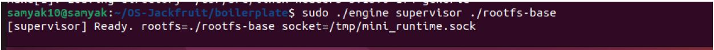
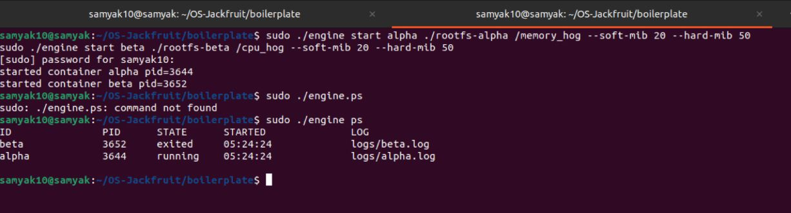
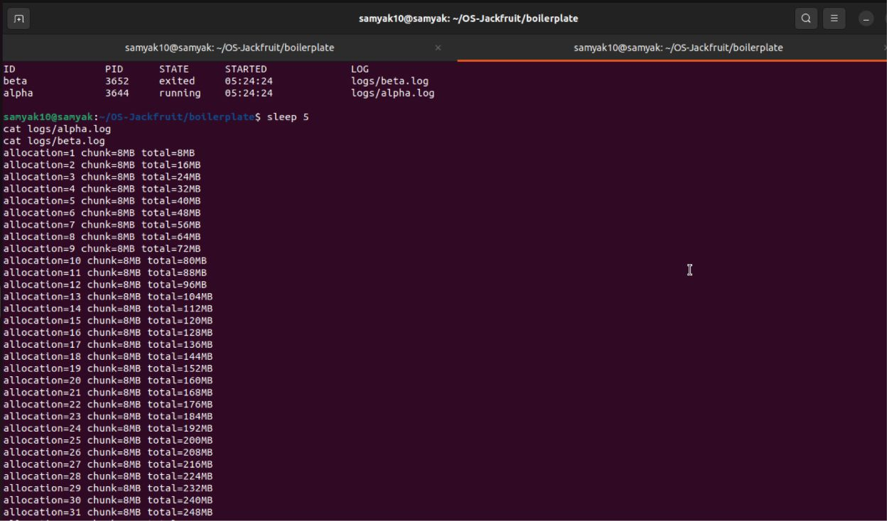
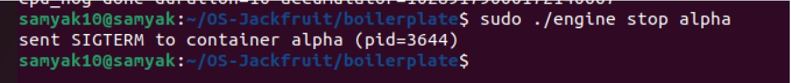
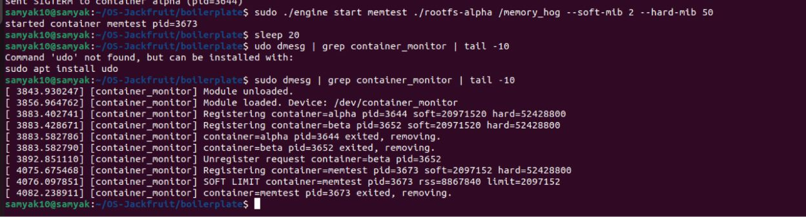
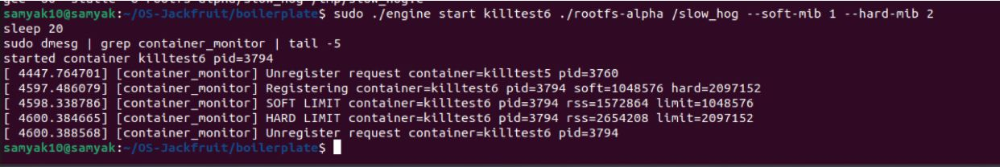
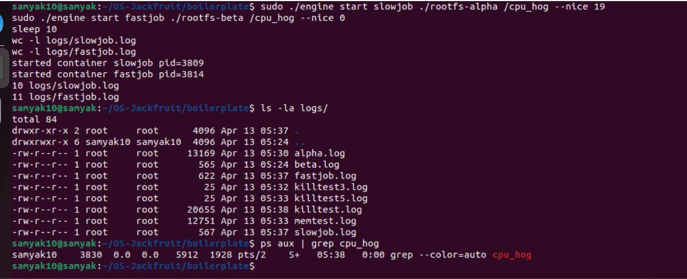
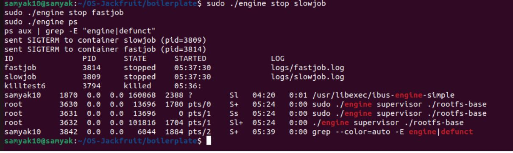
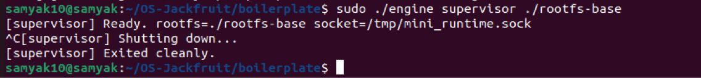

# OS Jackfruit Problem

## Team

- **Student 1:** Samyak Sanklecha — **PES2UG24CS436**
- **Student 2:** Shriram Chandrasekar — **PES2UG24CS495**

## Project Overview

This repository contains our submission for the **OS Jackfruit** (Multi‑Container Runtime) project.

The project has **two integrated parts**:

1. **User‑Space Runtime + Supervisor (`engine`)**
   - A long‑running **supervisor daemon** manages multiple containers concurrently.
   - A short‑lived **CLI client** sends commands to the supervisor over a control IPC channel.
   - Containers are created with Linux namespaces (PID/UTS/mount), a dedicated root filesystem, and `/proc` mounted inside.
   - Container output is captured via a **bounded‑buffer logging pipeline** and written to per‑container log files.

2. **Kernel‑Space Memory Monitor (`monitor.ko`)**
   - A Linux Kernel Module that tracks container processes (registered by the supervisor via `ioctl`).
   - Enforces **soft** and **hard** RSS limits:
     - Soft limit: warning logged once when exceeded.
     - Hard limit: container killed when exceeded.

For full requirements, CLI contract, and what the screenshots must demonstrate, see [`project-guide.md`](project-guide.md).

---

## Environment & Prerequisites

> Must be run on an **Ubuntu 22.04 / 24.04 VM** with **Secure Boot OFF** (kernel module loading). **WSL is not supported**.

Install dependencies:

```bash
sudo apt update
sudo apt install -y build-essential linux-headers-$(uname -r)
```

(Optional but recommended) Run the preflight check:

```bash
cd boilerplate
chmod +x environment-check.sh
sudo ./environment-check.sh
```

---

## Build Instructions

From the repo root:

```bash
cd boilerplate
make
```

CI‑safe build (used by GitHub Actions smoke check):

```bash
make -C boilerplate ci
```

---

## Root Filesystem Setup (Alpine)

Download and extract a minimal Alpine rootfs template:

```bash
mkdir rootfs-base
wget https://dl-cdn.alpinelinux.org/alpine/v3.20/releases/x86_64/alpine-minirootfs-3.20.3-x86_64.tar.gz
tar -xzf alpine-minirootfs-3.20.3-x86_64.tar.gz -C rootfs-base
```

Create one writable copy per container:

```bash
cp -a ./rootfs-base ./rootfs-alpha
cp -a ./rootfs-base ./rootfs-beta
```

> Do **not** commit `rootfs-base/` or `rootfs-*` directories.

---

## Kernel Module (Memory Monitor) Commands

Build should produce `monitor.ko`. Load it with:

```bash
sudo insmod monitor.ko
```

Verify it is loaded:

```bash
lsmod | grep monitor
```

Verify the device node exists (required by the spec):

```bash
ls -l /dev/container_monitor
```

View kernel logs (soft/hard limit events appear here):

```bash
dmesg | tail -n 50
```

Unload the module:

```bash
sudo rmmod monitor
```

---

## Supervisor + CLI (Required Command Interface)

The required CLI contract (from `project-guide.md`) is:

```bash
engine supervisor <base-rootfs>
engine start <id> <container-rootfs> <command> [--soft-mib N] [--hard-mib N] [--nice N]
engine run   <id> <container-rootfs> <command> [--soft-mib N] [--hard-mib N] [--nice N]
engine ps
engine logs <id>
engine stop <id>
```

A reference run sequence:

### 1) Start the supervisor (Terminal 1)

```bash
cd boilerplate
sudo ./engine supervisor ../rootfs-base
```

### 2) Start containers (Terminal 2)

```bash
cd boilerplate
sudo ./engine start alpha ../rootfs-alpha /bin/sh --soft-mib 48 --hard-mib 80
sudo ./engine start beta  ../rootfs-beta  /bin/sh --soft-mib 64 --hard-mib 96
```

### 3) List running containers / metadata

```bash
cd boilerplate
sudo ./engine ps
```

### 4) View logs for a container

```bash
cd boilerplate
sudo ./engine logs alpha
```

### 5) Stop containers

```bash
cd boilerplate
sudo ./engine stop alpha
sudo ./engine stop beta
```

---

## Screenshots (Detailed Walkthrough)

All screenshots are in the [`Screenshots/`](Screenshots) folder.

> Note: Each screenshot below is described using the **exact canonical commands** from the project guide. Your terminal output may include additional lines (warnings, timestamps, etc.), but the intent and flow match the required demo items.

### 1) `Screenshots/ss1.jpeg` — Environment setup & dependencies



**Goal:** Show the VM environment is prepared for compiling user‑space code and building/loading a kernel module.

**Commands used:**

```bash
sudo apt update
sudo apt install -y build-essential linux-headers-$(uname -r)
```

**What to look for:**
- `linux-headers-$(uname -r)` installs headers matching the running kernel (required for building the LKM).
- Successful `apt` output without missing packages.

### 2) `Screenshots/ss2.jpeg` — Build succeeds (`make`)



**Goal:** Demonstrate that the project compiles.

**Commands used:**

```bash
cd boilerplate
make
```

**What to look for:**
- `engine` user‑space binary builds.
- `monitor.ko` kernel module builds.
- Workload binaries (e.g., `cpu_hog`, `io_pulse`, `memory_hog`) build if included by your Makefile.

### 3) `Screenshots/ss3.jpeg` — Load kernel module + verify device



**Goal:** Show the memory monitor module is loaded and the control device exists.

**Commands used:**

```bash
cd boilerplate
sudo insmod monitor.ko
ls -l /dev/container_monitor
lsmod | grep monitor
```

**What to look for:**
- `/dev/container_monitor` should exist (typically a character device).
- `lsmod` output should include `monitor`.

### 4) `Screenshots/ss3(b).jpeg` — Start the supervisor daemon

.jpeg)

**Goal:** Show a long‑running supervisor is started and remains alive.

**Commands used:**

```bash
cd boilerplate
sudo ./engine supervisor ../rootfs-base
```

**What to look for:**
- Supervisor prints that it is listening for commands (implementation dependent).
- Terminal stays occupied (daemon running).

### 5) `Screenshots/ss4.jpeg` — Start multiple containers under one supervisor



**Goal:** Demonstrate multi‑container supervision (two containers running concurrently).

**Commands used (in a second terminal):**

```bash
cd boilerplate
sudo ./engine start alpha ../rootfs-alpha /bin/sh --soft-mib 48 --hard-mib 80
sudo ./engine start beta  ../rootfs-beta  /bin/sh --soft-mib 64 --hard-mib 96
```

**What to look for:**
- Both `start` commands succeed.
- Supervisor continues running and tracking both containers.

### 6) `Screenshots/ss5.jpeg` — `ps` metadata tracking



**Goal:** Show the supervisor tracks container metadata (IDs, PIDs, state, limits, etc.).

**Commands used:**

```bash
cd boilerplate
sudo ./engine ps
```

**What to look for:**
- Both `alpha` and `beta` listed.
- State reflects running/stopped correctly.
- Exit status / stop reason fields reflect what happened.

### 7) `Screenshots/ss6.jpeg` — Bounded‑buffer logging (`logs <id>`)



**Goal:** Demonstrate that container stdout/stderr is captured by the logging pipeline and persisted.

**Commands used:**

```bash
cd boilerplate
sudo ./engine logs alpha
```

**What to look for:**
- Log output corresponds to what was printed inside the container.
- Evidence that logs are per‑container (separate log files/streams).

### 8) `Screenshots/ss7.jpeg` — Soft limit warning evidence (`dmesg`)



**Goal:** Show a soft‑limit warning is generated when a container exceeds the configured soft RSS.

**Commands used:**

```bash
dmesg | tail -n 50
```

**What to look for:**
- A kernel log line indicating soft‑limit exceeded for a monitored PID/container.
- Warning should trigger when crossing the threshold (and typically only once per process).

### 9) `Screenshots/ss8.jpeg` — Hard limit enforcement evidence (`dmesg`) + metadata reflects kill



**Goal:** Show the container is killed after exceeding the hard limit and that the supervisor reflects the kill reason.

**Commands used:**

```bash
dmesg | tail -n 50
cd boilerplate
sudo ./engine ps
```

**What to look for:**
- Kernel log line showing hard‑limit enforcement (often SIGKILL).
- `engine ps` shows container state updated (e.g., `hard_limit_killed`).

### 10) `Screenshots/ss9.jpeg` — Clean teardown (no zombies, module unload)



**Goal:** Demonstrate cleanup: containers stopped/reaped, threads exit, module unload works.

**Commands used:**

```bash
cd boilerplate
sudo ./engine stop alpha
sudo ./engine stop beta

dmesg | tail -n 50
sudo rmmod monitor
```

**What to look for:**
- Containers stop cleanly.
- No stale entries or errors on unload.
- Kernel logs show orderly cleanup (implementation dependent).

---

## Notes

- Full spec, required demonstrations, and CLI contract: [`project-guide.md`](project-guide.md)
- Screenshots directory: [`Screenshots/`](Screenshots)